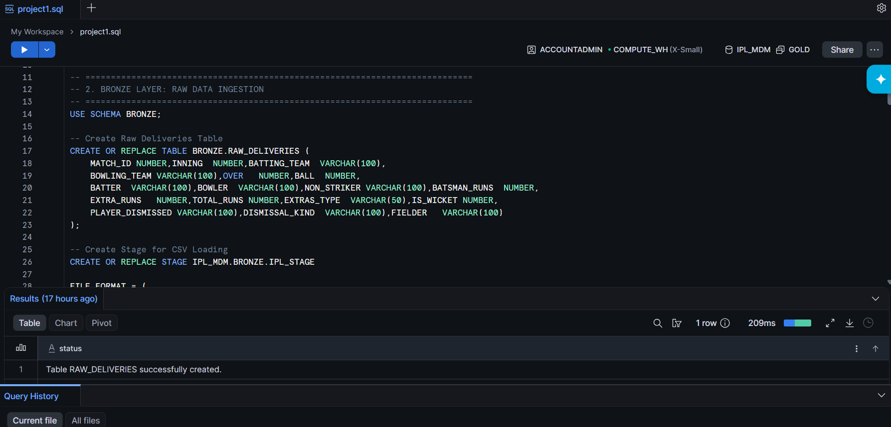
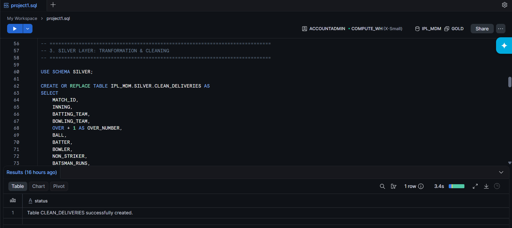
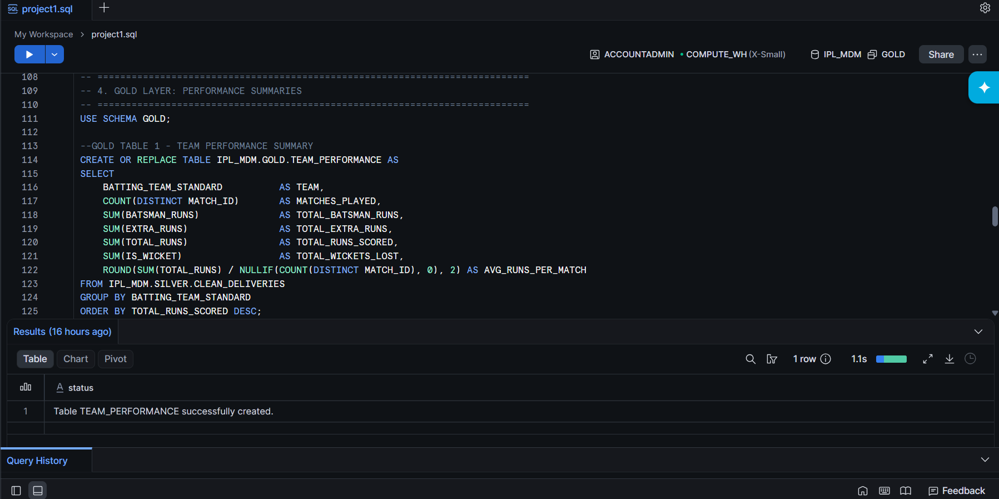
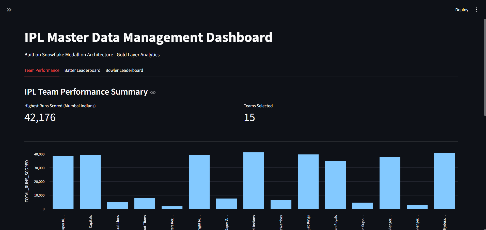
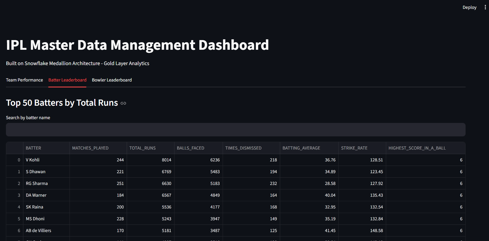
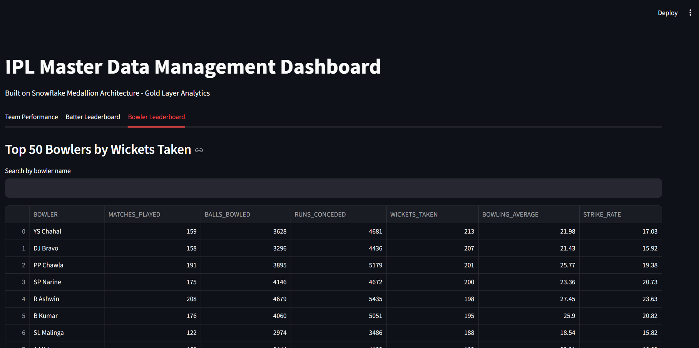

# Snowflake-IPL-MDM-Dashboard

An interactive, end-to-end cloud data engineering and sports analytics application. This project processes raw, semi-structured IPL datasets through a 3-tier **Medallion Architecture** inside Snowflake, applying rigorous Master Data Management (MDM) rules, and serves curated analytical tables directly to an interactive, web-based Streamlit dashboard interface.

---

## 🏗️ Pipeline Architecture Overview

This project implements an enterprise-grade modern data stack centered around cloud data warehousing, automated transformations, and rapid BI application deployment:

[ Raw Data Source: Kaggle ]

│
▼  (External Stage / COPY INTO)

[ 🟠 BRONZE LAYER ] ───► Stores raw data as VARIANT/Transient tables

│

▼  (LATERAL FLATTEN & MDM Cleaning Rules)

[ ⚪ SILVER LAYER ] ───► Cleaned, deduplicated tables (Name harmonization)

│

▼  (Dimensional Modeling / Star Schema)

[ 🟡 GOLD LAYER ]   ───► Fact & Dimension Tables optimized for BI

│

▼  (Snowflake-Connector-Python)

[ 📊 STREAMLIT UI ]  ───► High-performance interactive dashboard

---

## 💾 Dataset Information

Because the raw IPL data files are large and exceed standard GitHub web upload limits, the data is managed and hosted externally.

* **Source:** [Kaggle - IPL Complete Dataset (2008-2020) by Patrickb1912](https://www.kaggle.com/datasets/patrickb1912/ipl-complete-dataset-20082020)
* **Ingestion Method:** Uploaded directly into an external cloud landing zone stage before executing targeted Snowflake COPY routines.

---

## ⚙️ Medallion Pipeline Implementation

### 🟠 1. Bronze Layer (Ingestion)
In this initial stage, raw file structures are mirrored directly into the data warehouse without structural changes to ensure complete data lineage.
* **Database Schema:** `IPL_DB.BRONZE`
* **Objects Created:** Dedicated CSV File Formats, external/internal data stages, and transient landing tables.
* **Key Operations:** Handling messy string truncations and loading varying data lengths safely.

<details>
<summary><b>📷 Click to view Bronze Ingestion Code & Raw Landing Data</b></summary>



</details>

### ⚪ 2. Silver Layer (Transformation & MDM)
The Silver layer cleanses, flattens, and enforces Master Data Management (MDM) rules on the raw records to build a single, trusted source of truth.
* **Data Flattening:** Extracted deeply nested array-based tracking into structured, queryable data rows.
* **MDM & Data Quality Rules Applied:** * Cleaned inconsistent player name variants (e.g., standardizing middle initials and spelling typos).
  * Harmonized changing franchise identities across historic seasons (e.g., mapping *Delhi Daredevils* $\rightarrow$ *Delhi Capitals*).
  * Enforced rigid data type casting (`::INT`, `::VARCHAR`) and configured null-handling logic for abandoned matches.

<details>
<summary><b>📷 Click to view SQL Transformation & Naming Reconciliation Rules</b></summary>



</details>

### 🟡 3. Gold Layer (Analytics & Dimensional Modeling)
The Gold layer structures the cleaned data into an optimized **Star Schema** designed for lightning-fast business intelligence query runtimes.
* **Dimensional Design:** Modeled `DIM_PLAYERS`, `DIM_TEAMS`, `DIM_VENUES`, and a highly indexed `FACT_BALL_BY_BALL` table.
* **Pre-calculated Performance Metrics:** Aggregated key parameters such as batsman strike rates in death overs, bowler economy rates by powerplay phases, and venue-specific win probabilities based on toss selections.

<details>
<summary><b>📷 Click to view Analytical Queries & Star Schema Performance Matrix</b></summary>



</details>

---

## 🌟 Dashboard Key Features

* **Secure Secrets Management:** Implements `st.secrets` to prevent database configuration strings, user credentials, and passwords from being exposed to public version control.
* **State Management & Optimization:** Uses `@st.cache_resource` with operational lifecycle validation routines to persist a single, stable Snowflake database connection, eliminating handshake overhead.
* **Smart Data Caching:** Leverages `@st.cache_data` on analytical dataframes to significantly minimize unnecessary compute costs on Snowflake virtual warehouses.
* **Dynamic Team Comparison:** Interactive sidebar multiselect components automatically bind to analytical bar charts and live KPI metrics.
* **Real-time String Filter Lookups:** Client-side case-insensitive regex search bars built across Batter and Bowler Leaderboard tabs to filter top-50 statistics instantly.

---

## 📊 Interface Previews

<details>
<summary><b>📷 Click to view Main Dashboard UI</b></summary>



</details>

<details>
<summary><b>📷 Click to view Batter Section UI</b></summary>



</details>

<details>
<summary><b>📷 Click to view Bowler Section UI</b></summary>



</details>

---

## 📁 Repository Directory Structure

```text
├── .streamlit/
│   └── secrets.toml      # LOCAL ONLY: Hidden database credentials (ignored by git)
├── data/                 # Sample raw data subsets for local debugging
├── sql_scripts/          # Curated Snowflake scripts (Bronze, Silver, Gold layers)
│   ├── 1_bronze_ingest.sql
│   ├── 2_silver_transform.sql
│   └── 3_gold_analytics.sql
├── images/               # Screenshots used for documentation
├── .gitignore            # Explicitly blocks security risks (secrets.toml) from uploading
├── app.py                # Main application entrypoint containing layouts and dashboard logic
└── requirements.txt      # Python library environment dependency list

